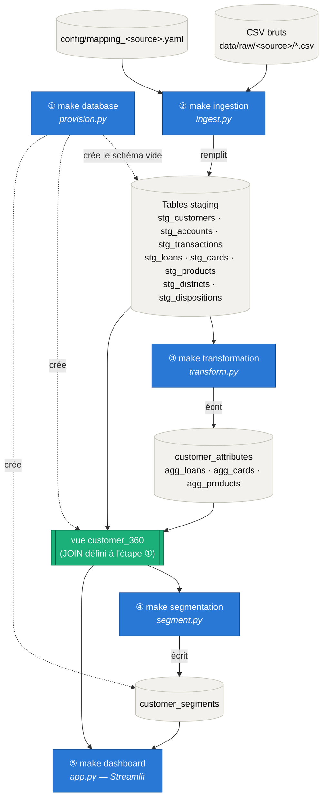

# ClustIQ — Customer 360 & Segmentation Pipeline

ClustIQ est un pipeline Customer 360 + segmentation client, conçu pour être **générique et paramétrable** : démontré ici sur le dataset public **[Berka](https://www.kaggle.com/datasets/marceloventura/the-berka-dataset)** (PKDD'99, banque tchèque), il est directement adaptable aux données réelles de la STB (Société Tunisienne de Banque) par simple ajout d'un fichier de mapping YAML — **aucune modification de code**.

## 1. Architecture

Le pipeline s'exécute en 5 étapes, chacune une cible `make` distincte, toujours dans cet ordre. `make all` enchaîne les 4 premières (database → ingestion → transformation → segmentation) ; `dashboard` se lance séparément, car c'est un serveur, pas une étape ponctuelle (voir §4).



Le contrat entre étapes est le **schéma canonique** défini dans [config/schema.yaml](config/schema.yaml) — une ligne de la vue `customer_360` par transaction, enrichie des attributs client/compte/crédit/carte/produit. Il ne change jamais, quelle que soit la source de données.

### 1.1 Tables et vues MySQL

Tous les noms sont paramétrés dans [config/database.yaml](config/database.yaml) — aucun n'est codé en dur dans le SQL, pandas ou Streamlit.

| Table / vue | Type | Écrite par | Lue par | Contenu |
| --- | --- | --- | --- | --- |
| `customer_360` | Vue | ① `make database` (définition SQL, [02_create_customer_360_view.sql](src/database/02_create_customer_360_view.sql)) | `make segmentation`, dashboard | Jointure de `stg_transactions`, `stg_accounts`, `stg_dispositions` et des tables ci-dessous — le schéma canonique |
| `stg_customers`, `stg_accounts`, `stg_transactions`, `stg_loans`, `stg_cards`, `stg_products`, `stg_districts`, `stg_dispositions` | Table (staging) | ② `make ingestion` ([ingest.py](src/ingestion/ingest.py)) | `make transformation`, vue `customer_360` | Données brutes renommées vers le schéma canonique, une table par entité |
| `customer_attributes` | Table | ③ `make transformation` ([transform.py](src/transformation/transform.py)) | vue `customer_360` | Un client par ligne : âge, genre, région, catégorie, fréquence de transaction, nb de produits |
| `agg_loans`, `agg_cards`, `agg_products` | Table | ③ `make transformation` | vue `customer_360` | Dernier crédit / carte / produit actif par compte |
| `customer_segments` | Table | ④ `make segmentation` ([segment.py](src/segmentation/segment.py)) | dashboard | `customer_id`, `segment`, et les features numériques utilisées pour le clustering |

Le dashboard ne lit que `customer_360` et `customer_segments` — jamais les tables staging ou intermédiaires directement.

## 2. Structure du projet

```text
config/
  schema.yaml                # schéma canonique (contrat fixe)
  database.yaml                # connexion MySQL, chunksizes, noms de tables
  segmentation.yaml            # features + hyperparamètres du clustering
  mapping_berka.yaml           # mapping Berka -> schéma canonique (POC)
  mapping_berka_sample.yaml     # idem, sur l'échantillon data/raw/berka_sample/
  mapping_stb.yaml             # template vide, à remplir pour brancher la STB
data/raw/berka/                # fichiers CSV bruts du POC
data/raw/berka_sample/          # sous-ensemble référentiellement cohérent (test rapide)
src/
  common/                      # config loader, logging, connexion MySQL (SQLAlchemy)
  ingestion/                    # lecture brute + application du mapping (pandas) -> ingest.py
  database/                     # DDL tables staging, vue customer_360, table segments -> provision.py
  transformation/                # nettoyage, jointures, agrégations (pandas) -> transform.py
  segmentation/                  # feature engineering + KMeans (scikit-learn) -> segment.py
  dashboard/                     # application Streamlit -> app.py
tests/                          # tests unitaires
```

Chaque dossier sous `src/` correspond à une étape du pipeline et à une cible `make` du même nom (`make ingestion`, `make database`, `make transformation`, `make segmentation`, `make dashboard`).

`src/` est un *namespace package* Python (pas de `__init__.py`) : les imports `from src.common...` fonctionnent tant que la racine du projet est sur `sys.path` (cas normal via `python -m src.xxx`).

## 3. Installation

Prérequis : Python 3.10+, MySQL Server 8.x accessible, `make`.

```bash
cp .env.example .env        # renseigner les identifiants MySQL et DATA_SOURCE
make setup                  # crée .venv et installe requirements.txt
```

## 4. Utilisation

```bash
make database        # crée les tables staging, la vue customer_360, la table de segments
make ingestion         # ingère data/raw/<DATA_SOURCE>/*.csv vers les tables staging MySQL
make transformation     # nettoyage + agrégations -> customer_attributes, agg_loans, agg_cards, agg_products
make segmentation       # feature engineering + K-Means -> table customer_segments
make dashboard           # lance le dashboard Streamlit (http://localhost:8501)

make all               # enchaîne database -> ingestion -> transformation -> segmentation
make test               # exécute les tests unitaires (pytest)
make clean               # supprime .venv et les caches
```

L'ordre `database` avant `ingestion`/`transformation`/`segmentation` est important : il garantit que les tables sont créées avec le typage défini en DDL ([src/database/01_create_tables.sql](src/database/01_create_tables.sql)) avant tout chargement (`TRUNCATE` + `INSERT`, pas `DROP`/`CREATE`).

Le dataset Berka complet (`trans.csv` ~1M lignes) prend plusieurs minutes à ingérer. Pour un test rapide, `data/raw/berka_sample/` contient un sous-ensemble référentiellement cohérent (60 comptes) : `DATA_SOURCE=berka_sample` dans `.env` (ou `make ingestion SOURCE=berka_sample`).

## 5. KPI du dashboard

- **Clients actifs** : nombre de clients distincts dans la segmentation.
- **Solde moyen** : moyenne du dernier solde connu par compte.
- **Produits moyens / client** : nombre moyen de types de produits distincts souscrits.
- **Fréquence de transaction moyenne** : nombre moyen de transactions par client.
- **Répartition des segments** : distribution des clients par cluster K-Means.
- **Profils à forte valeur** : clients triés par solde moyen et encours de crédit.
- **Clients à fort potentiel** : forte fréquence de transaction mais peu de produits souscrits (potentiel de cross-sell).

Filtres dynamiques disponibles : région, tranche d'âge, segment.

## 6. Ajouter une nouvelle source de données (ex. STB)

1. Déposer les exports bruts dans `data/raw/<source>/`.
2. Copier [config/mapping_stb.yaml](config/mapping_stb.yaml) (déjà présent comme template) et le compléter :
   - `source_file` : nom du fichier source pour chaque entité (customers, districts, dispositions, accounts, transactions, loans, cards, products).
   - `columns` : mapping `colonne_source -> colonne_canonique` (voir [config/schema.yaml](config/schema.yaml) pour la liste des colonnes canoniques).
   - `transforms` (optionnel) : fonctions de décodage/typage référencées par nom (voir [src/ingestion/column_transforms.py](src/ingestion/column_transforms.py)).
3. Lancer le pipeline sur la nouvelle source (`DATA_SOURCE=stb` dans `.env`, ou) :

   ```bash
   make database
   make ingestion SOURCE=stb
   make transformation
   make segmentation
   make dashboard
   ```

Aucun fichier SQL, pandas ou Streamlit n'est à modifier : ils ne manipulent que les noms de colonnes/tables canoniques.

## 7. Pas de cache

Choix délibéré pour ce POC : le bytecode Python n'est pas écrit sur disque (`python -B`), pytest n'écrit pas de `.pytest_cache`, et le dashboard Streamlit relit MySQL à chaque interaction (pas de `@st.cache_data`).

## 8. Limites connues du POC (dataset Berka)

- `product_subscription_date` n'est pas disponible dans Berka (les ordres de virement permanent n'ont pas de date de souscription) — la colonne reste `NULL`. Une source réelle devra la fournir.
- `customer_category` est calculée par une règle métier simple et illustrative (présence de crédit/carte/produit) — à affiner avec le métier STB.
- Le nombre de clusters K-Means est déterminé automatiquement par score de silhouette dans la plage `[k_min, k_max]` définie dans [config/segmentation.yaml](config/segmentation.yaml) (ou fixé via `fixed_k`).

## 9. Base MySQL et source active

Deux variables distinctes dans `.env`, sans valeur par défaut codée en dur :

- `MYSQL_DATABASE` : nom de la base MySQL du projet (`clustiq`).
- `DATA_SOURCE` : source active du pipeline (`berka`, `berka_sample`, `stb`...) — détermine `config/mapping_<DATA_SOURCE>.yaml` et `data/raw/<DATA_SOURCE>/`.

`make ingestion`/`python -m src.ingestion.ingest` échouent explicitement si `DATA_SOURCE` n'est renseigné ni dans `.env` ni via `SOURCE=xxx`/`--source` sur la ligne de commande (qui reste prioritaire sur `.env` pour un run ponctuel). Toutes les sources partagent la même base `clustiq` — changer de source recharge les tables staging avec les nouvelles données.
